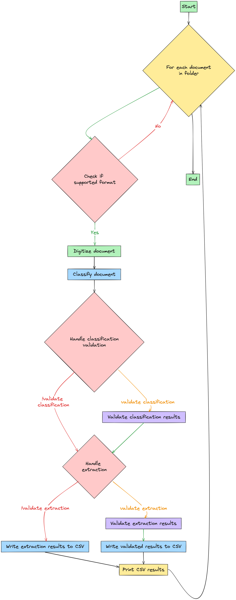

# Document Understanding Cloud APIs Example

This code snippet demonstrates how to digitize, classify, validate, and extract documents using UiPath Document Understanding API's.

## Official Documentation

UiPath Document Understanding offers standalone capabilities, allowing integration with external tools and systems through APIs. This release includes APIs for Discovery, Digitization, Classification, Extraction, and Validation. Please take a look at the [Official Documentation](https://docs.uipath.com/document-understanding/automation-cloud/latest/api-guide/example).


## Process Flowchart



## Requirements

- Python 3.11+
- `requests` library
- `python-dotenv` library

## Setup

1. Clone the repository to your local machine:

    ```bash
    git clone https://github.com/nvpnathan/DU-Cloud-APIs.git
    ```

2. Navigate to the project directory:

    ```bash
    cd DU-Cloud-APIs
    ```

3. Install the required dependencies:

    ```bash
    pip3 install -r requirements.txt
    ```

4. Set up your environment variables by copying `.env.example` to `.env` file in the root directory and provide the `APP_ID` and `APP_SECRET` from your Cloud Envirnment:

  ```env
  APP_ID=
  APP_SECRET=
  AUTH_URL=https://cloud.uipath.com/identity_/connect/token
  BASE_URL=https://cloud.uipath.com/<Cloud Org>/<Cloud Tenant>/du_/api/framework/projects/
  PROJECT_ID=00000000-0000-0000-0000-000000000000
  ```

## Usage

### Processing Documents

1. Place the documents you want to process in the specified folder (`Example Documents` by default).

2. Run the main script `main.py` to process the documents:

    ```bash
    python3 src/main.py
    ```

3. Monitor the console output for processing status and any errors.

4. Extracted results will be printed to the console and saved in CSV format in the same folder as the processed documents.

## File Structure

The project structure is organized as follows:
```bash
DU-Cloud-APIs/
│
├── src/
│   ├── main.py         # Main entry point for the application
│   ├── auth.py         # Authentication module for obtaining bearer token
│   ├── digitize.py     # Digitize module for initiating document digitization
│   ├── classify.py     # Classify module for document classification
│   ├── extract.py      # Extract module for document extraction
│   ├── validate.py     # Validate module for document validation
│   └── result_utils.py # Utility module for printing and writing extraction results
│
├── .env.example         # Example environment variables file
├── requirements.txt     # Python modules configuration file
├── example_documents/   # Folder containing example documents
├── generative_prompts/  # Folder containing Extraction and Classification Prompt Templates
└── output_results/      # Folder containing the CSV's of the Document Extraction Results
```

## TODO

* Write Tests
* Write Discovery API
* Add [Black](https://github.com/psf/black)
